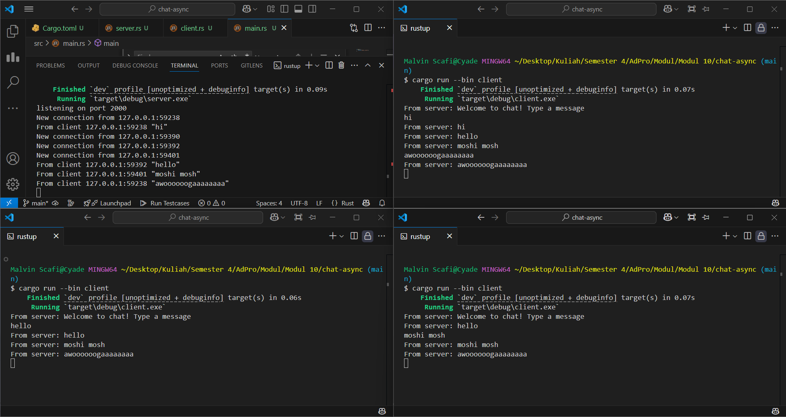

# Tutorial 10
**Nama:**   Malvin Scafi 
**NPM:**    2306152430 
**Kelas:**  AdvProg A 

## Modul 10
### Experiment 2.1

- Dalam gambar diatas, terdapat satu *server* dan tiga *client*. Setiap *client* akan terhubung ke *server* menggunakan WebSocket melalui port 2000. *Server* akan terus mendengarkan koneksi yang masuk pada port tersebut. Ketika ada koneksi baru, *server* akan mencatat informasi ke *console* dan mengirimkan pesan welcome kepada *client*. Di sisi *client*, program akan menunggu masukan dari `stdin`. Jika pengguna mengetikkan pesan, *client* akan mengirimkan pesan tersebut ke *server*. Selanjutnya, *server* akan terus berjalan dalam loop untuk menerima pesan dari *client*. Setelah pesan diterima, *server* akan mengirimkan pesan tersebut ke semua *client* yang terhubung. Sementara itu, *client* juga akan terus berjalan dalam loop untuk menerima pesan dari *server*. Ketika pesan diterima, pesan tersebut akan ditampilkan di *console*.