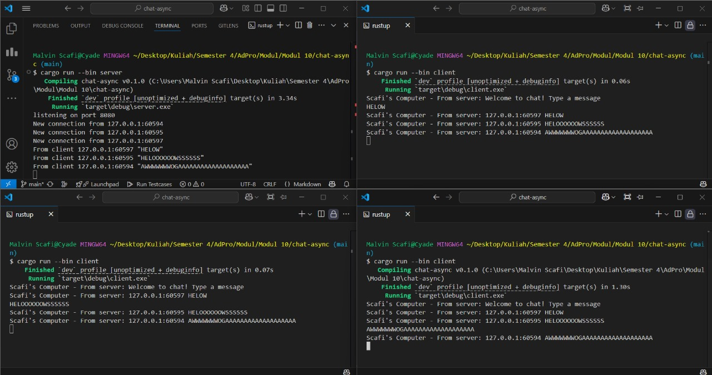

# Tutorial 10
**Nama:**   Malvin Scafi 
**NPM:**    2306152430 
**Kelas:**  AdvProg A 

## Modul 10
### Experiment 2.1

- Dalam gambar diatas, terdapat satu *server* dan tiga *client*. Setiap *client* akan terhubung ke *server* menggunakan WebSocket melalui port 2000. *Server* akan terus mendengarkan koneksi yang masuk pada port tersebut. Ketika ada koneksi baru, *server* akan mencatat informasi ke *console* dan mengirimkan pesan welcome kepada *client*. Di sisi *client*, program akan menunggu masukan dari `stdin`. Jika pengguna mengetikkan pesan, *client* akan mengirimkan pesan tersebut ke *server*. Selanjutnya, *server* akan terus berjalan dalam loop untuk menerima pesan dari *client*. Setelah pesan diterima, *server* akan mengirimkan pesan tersebut ke semua *client* yang terhubung. Sementara itu, *client* juga akan terus berjalan dalam loop untuk menerima pesan dari *server*. Ketika pesan diterima, pesan tersebut akan ditampilkan di *console*.

### Experiment 2.2
- Untuk mengubah port yang digunakan, kita perlu menyesuaikan port tempat *server* menerima koneksi dan port yang digunakan *client* untuk terhubung. Pada sisi *server*, perubahan dilakukan dengan mengganti kode menjadi `let listener = TcpListener::bind("127.0.0.1:8080").await?;` sehingga *server* akan mendengarkan koneksi pada `localhost` di port 8080. Agar *client* tetap dapat terhubung, URI yang digunakan juga harus diperbarui menjadi `let (mut ws_stream, _) = ClientBuilder::from_uri(Uri::from_static("ws://127.0.0.1:8080")).connect().await?;`. Dengan pembaruan ini, *client* akan menggunakan protokol WebSocket untuk terhubung ke port 8080, memastikan komunikasi antara *server* dan *client* tetap berjalan dengan baik.

### Experiment 2.3

- Pada kode saya mengubah dua hal, pertama di sisi *client* ditambahkan pesan "Scafi's Computer" yang menandakan bahwa *client* dijalankan pada komputer pengguna. Saya melakukan perubahan pada perintah `println!` yang mencetak pesan dari *server* ke *console* yakni : `println!("Scafi's Computer - From server: {}", text);`. Kedua di sisi *server* ditambahkan informasi alamat IP dan port pada setiap pesan yang diterima dan dikirimkan ke *client*. Saya melakukan perubahan pada perintah `println!` yakni : `println!("From client {addr:?} {text:?}");` dan menyesuaikan pengiriman pesan melalui `bcast_tx.send(format!("{} {}", addr, text))?;`. Penyesuaian ini dilakukan di sisi *server* agar *client* yang terhubung menerima pesan yang sudah dilengkapi alamat IP dan port tanpa memerlukan perubahan tambahan di sisi *client*.

